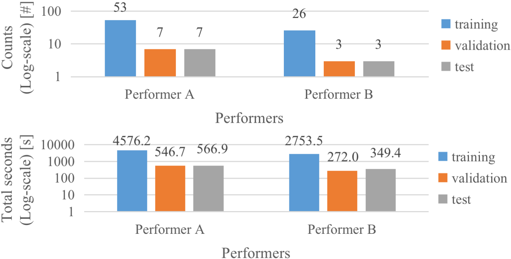
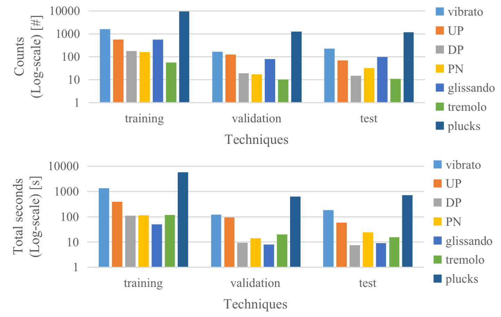

# Frame-Level Multi-Label Playing Technique Detection Using Multi-Scale Network and Self-Attention Mechanism
## Dichucheng Li, Mingjin Che, Wenwu Meng, Yulun Wu, Yi Yu, Fan Xia, Wei Li


<!-- ### Abstract of the paper
```
Instrument playing technique (IPT) is a key element of musical presentation. However, most of the existing works for IPT detection only concern monophonic music signals, yet little has been done to detect IPTs in polyphonic instrumental solo pieces with overlapping IPTs or mixed IPTs. In this paper, we formulate it as a frame-level multi-label classification problem and apply it to Guzheng, a Chinese plucked string instrument. We create a new dataset, Guzheng\_Tech99, containing Guzheng recordings and onset, offset, pitch, IPT annotations of each note. Because different IPTs vary a lot in their lengths, we propose a new method to solve this problem using multi-scale network and self-attention. The multi-scale network extracts features from different scales, and the self-attention mechanism applied to the feature maps at the coarsest scale further enhances the long-range feature extraction. Our approach outperforms existing works by a large margin, indicating its effectiveness in IPT detection.

``` -->
[Download the demo files or obtain all files in the database](https://ccmusic-database.github.io/en/database/csmtd.html#Tech99)
### Abstract of the paper

Instrument playing technique (IPT) is a key element of musical presentation. However, most of the existing works for IPT detection only concern monophonic music signals, yet little has been done to detect IPTs in polyphonic instrumental solo pieces with overlapping IPTs or mixed IPTs. In this paper, we formulate it as a frame-level multi-label classification problem and apply it to Guzheng, a Chinese plucked string instrument. We create a new dataset, Guzheng\_Tech99, containing Guzheng recordings and onset, offset, pitch, IPT annotations of each note. Because different IPTs vary a lot in their lengths, we propose a new method to solve this problem using multi-scale network and self-attention. The multi-scale network extracts features from different scales, and the self-attention mechanism applied to the feature maps at the coarsest scale further enhances the long-range feature extraction. Our approach outperforms existing works by a large margin, indicating its effectiveness in IPT detection.

#### Description

The paper will be released at ICASSP 2023 (IEEE International Conference on Acoustics, Speech, and Signal Processing).

More to be appeared……

# Statistics of the performer/IPTs in each data split. upper: counts, lower: total duration.
<div style="text-align: center;">
    
</div>
<div style="text-align: center;">
    
</div>
