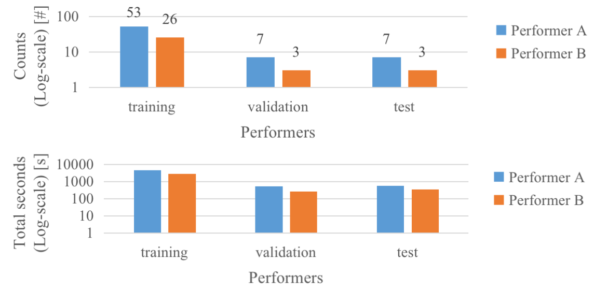

# Frame-Level Multi-Label Playing Technique Detection Using Multi-Scale Network and Self-Attention Mechanism
## Dichucheng Li, Mingjin Che, Wenwu Meng, Yulun Wu, Yi Yu, Fan Xia, Wei Li

[database](https://ccmusic-database.github.io/en/database/csmtd.html#Tech99) \\
[code](https://github.com/LiDCC/GuzhengTech99) \\
[paper on Arxiv](https://arxiv.org/pdf/2303.13272.pdf)
### Abstract of the paper

Instrument playing technique (IPT) is a key element of musical presentation. However, most of the existing works for IPT detection only concern monophonic music signals, yet little has been done to detect IPTs in polyphonic instrumental solo pieces with overlapping IPTs or mixed IPTs. In this paper, we formulate it as a frame-level multi-label classification problem and apply it to Guzheng, a Chinese plucked string instrument. We create a new dataset, Guzheng\_Tech99, containing Guzheng recordings and onset, offset, pitch, IPT annotations of each note. Because different IPTs vary a lot in their lengths, we propose a new method to solve this problem using multi-scale network and self-attention. The multi-scale network extracts features from different scales, and the self-attention mechanism applied to the feature maps at the coarsest scale further enhances the long-range feature extraction. Our approach outperforms existing works by a large margin, indicating its effectiveness in IPT detection.

### Statistics of the data splits.
 - The dataset is split into 79, 10, 10 songs respectively for the training set, the validation set, and the test set. 
 - When splitting, we control the distribution of IPT types and performers in the three sets to be as similar as possible.

    

Statistics of the performers in each data split. upper: counts, lower: total duration.

---------------------------------------------------------------------------------------------

    

Statistics of the IPT labels in each data split. upper: counts, lower: total duration.

### Metadata
It contains songlist. It contains following information:

<iframe width="1000" height="500" src="https://docs.google.com/spreadsheets/d/e/2PACX-1vRFogTkRxz7V736qZ0Bg243kQFa3Jy5NapjypwMfRlg0LpMq7ma4ehmJ-G-cH7Ny_h9PJDKK88u7W2h/pubhtml?widget=true&amp;headers=false"></iframe>
